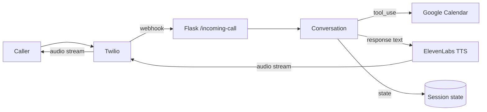

# ai-voice-agent-twilio-claude

[](https://www.python.org)
[](https://www.twilio.com/voice)
[](https://docs.anthropic.com/claude/docs/tool-use)
[](./LICENSE)

Twilio voice agent that takes inbound calls, answers in Spanish or English, and books appointments on a Google Calendar via Claude tool use.



## Stack

* Twilio Voice for telephony
* Flask webhook
* Anthropic Claude with two tools: `check_availability`, `book_appointment`
* ElevenLabs streaming TTS for sub-second first-byte latency
* Google Calendar API for the booking itself

## Run locally

```
pip install -r requirements.txt
cp .env.example .env   # fill in keys
ngrok http 5000
make run
```

Point the Twilio voice webhook to `https://<ngrok-url>/incoming-call`.

## Tests

```
make test
```

21 tests, no real API calls, no flake.

## Notes

`src/voice_agent/state.py` tracks the call lifecycle so a handoff to a human is something the system can decide on, not just a fallback.

`conversation.py` keeps tool definitions next to the system prompt so changes do not drift between the two.

If you swap ElevenLabs for AWS Polly the latency goes up about a second per turn but you keep everything inside AWS. There is also a `_stub_response` in `app.py` for local dev without an Anthropic key configured.

## License

MIT
