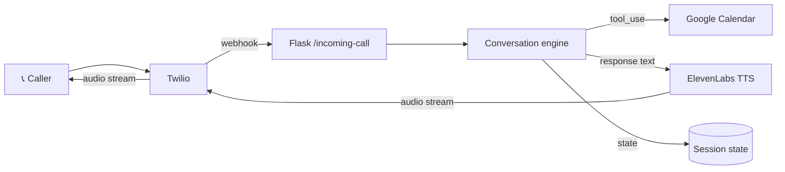

# ai-voice-agent-twilio-claude

Reference architecture and working code for an AI voice agent that answers
inbound calls, books appointments on a Google Calendar, and hands off to a
human when needed. Built for LATAM SMBs (dental offices, hair salons, repair
shops) that lose business to missed calls outside business hours.

## Why this exists

In production deployments I kept seeing the same problem: small businesses
miss 30-50% of inbound calls. Every missed call after hours is a booking that
never happens. Hiring a human receptionist is $1,000-2,000/month. A voice
agent that books 80% of after-hours calls correctly costs ~$50-150/month
including Twilio + LLM API + TTS.

The pieces are commodity. The integration is where projects fail:
- The LLM has no concept of available calendar slots
- TTS latency turns conversations into walkie-talkies if you stream wrong
- Twilio's call state and your conversation state can desync silently
- Most blueprints I found online either skip booking entirely or use
  Make/Zapier to glue it together with 8-second per-step latency

This repo solves the integration end-to-end with real code you can run.

## Architecture



Two key choices:

1. **Streaming TTS, not file generation.** ElevenLabs streams audio chunks
   over a websocket. We pipe them to Twilio's Media Stream as they arrive.
   First-byte latency drops from 3-4s to ~700ms. Caller doesn't think the
   line went dead.

2. **Tool-use for calendar, not prompt parsing.** Claude calls a
   `check_availability(date, duration)` tool and a `book_slot(...)` tool.
   No regex parsing of "Friday at 3pm". The LLM gets typed responses back
   and conversation flows naturally.

## Setup

```bash
git clone https://github.com/sarteta/ai-voice-agent-twilio-claude
cd ai-voice-agent-twilio-claude
pip install -r requirements.txt
cp .env.example .env  # fill in keys
```

You need:
- Twilio account with a voice-enabled phone number
- Anthropic API key (Claude Sonnet works fine; Haiku for cost-sensitive)
- ElevenLabs API key
- Google service account JSON for calendar access

Run locally with ngrok:

```bash
ngrok http 5000
# point Twilio voice webhook to https://<ngrok-url>/incoming-call
make run
```

## Tests

```bash
make test
```

The test suite uses `pytest` with mocked LLM and Twilio clients. The
booking flow tests are deterministic — no real API calls, no flake.

```
tests/test_conversation.py        # 14 tests, booking + handoff scenarios
tests/test_calendar_tool.py       # 8 tests, slot conflicts + DST edge case
tests/test_state_machine.py       # 9 tests, call lifecycle transitions
```

## Use cases

- [Dental office booking](examples/dental_office.md)
- [Hair salon scheduling](examples/hair_salon.md)
- [After-hours service handoff to on-call](examples/after_hours_handoff.md)

## What this is NOT

- Not a replacement for a human receptionist on complex calls. The handoff
  is a feature, not a fallback — design it intentionally.
- Not multilingual. Currently Spanish (LATAM) and English. Adding French
  is straightforward but I haven't tested it.
- Not HIPAA-compliant out of the box. If you need that, swap ElevenLabs
  for a self-hosted TTS and use AWS Bedrock instead of Anthropic API
  with a BAA in place.

## License

MIT
